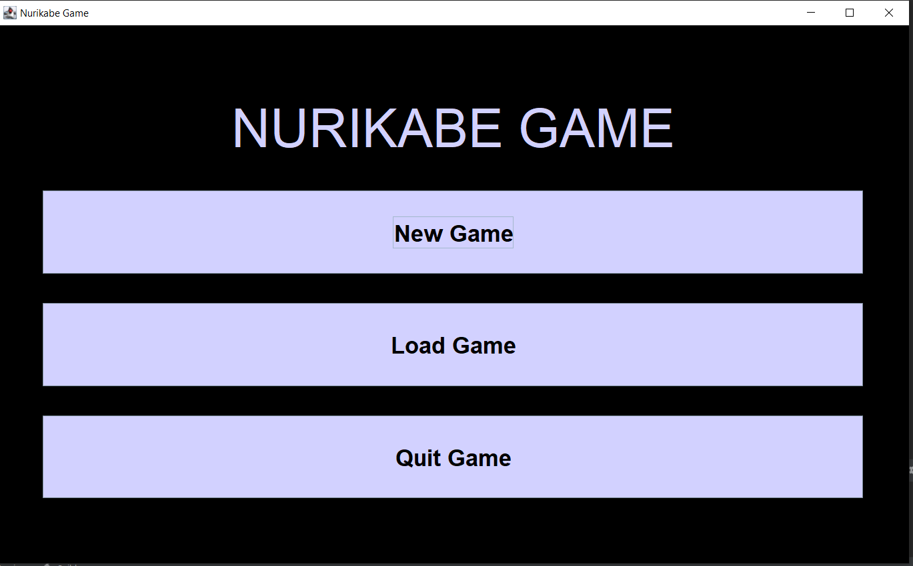
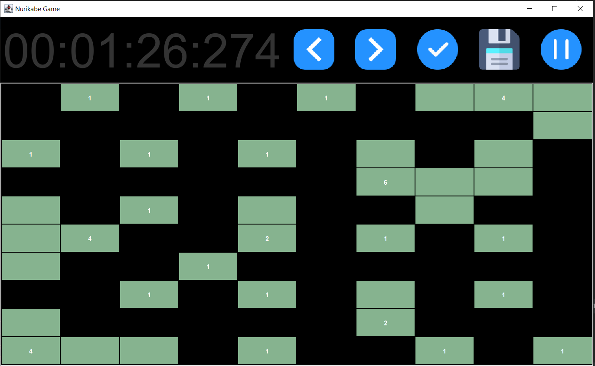
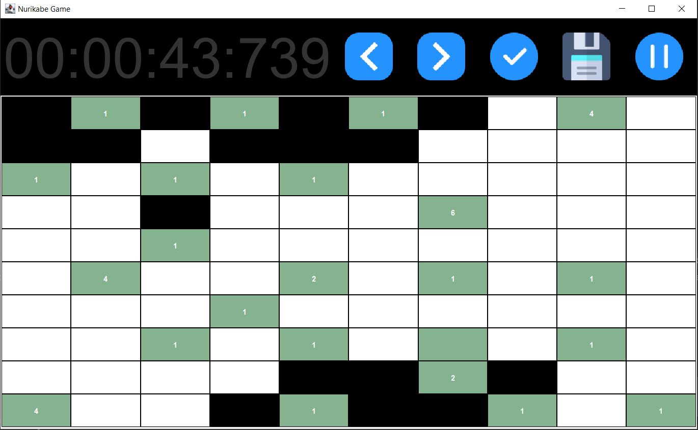
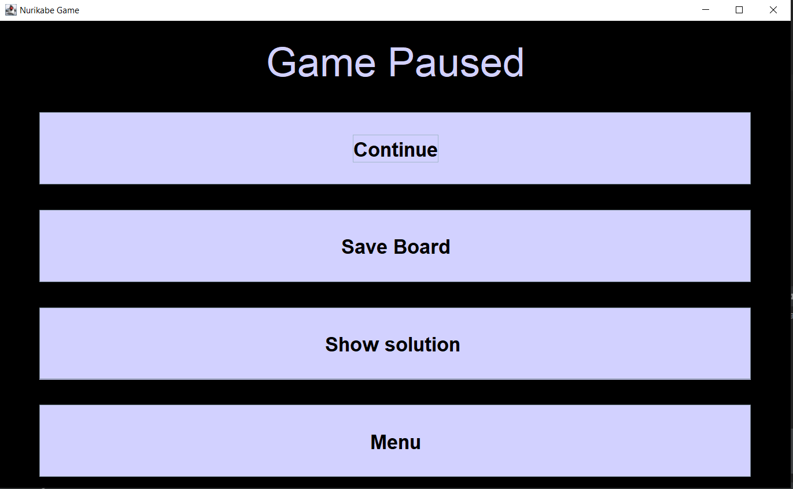

# Nurikabe Game

## Introduction

The Nurikabe Game is a <b>Java-based</b> puzzle game created using <b>Swing</b>. Nurikabe is a logic-based puzzle in which players need to fill a grid with islands represented by green color and water cells by black, following specific rules. This README provides information on how to run and play the game.
<p align="center">
  
</p>
<p align="center">
  
</p>
<p align="center">
  
</p>
<p align="center">
  
</p>
## Features

- Interactive GUI created with Java Swing.
- Implemented an algorithm that generates a board to solve based on the chosen difficulty.
- Customizable grid size and difficulty levels.
- Logic-based Nurikabe puzzle rules.
- Ability to fill cells with 3 colors.
- Check for correctness and win the game.
- Ability to backtrack your moves.
- Ability to save and load game from file.
- Timer.
- Solver.

## Prerequisites

To run the Nurikabe Game, you need to have the following installed on your system:

- Java Runtime Environment (JRE) version 17 or higher.

## How to Run
Download the Nurikabe from github using following command:

   ```bash
   git clone https://github.com/Wflikeit/Nurikabe_game
   ```
Congratulations now you can run the Main.java and enjoy your game!


## How to Play

1. At first the grid contains white cells and green cells with numbers.
2. Use the mouse to click on cells to change their colors.
3. Follow the Nurikabe rules:
    - Green cells with numbers represent islands, where each number indicates the total size that must be fulfilled.
    - The size can be increased by attaching green cells to the island such that they are adjacent horizontally or vertically.
    - Each island has to contain exactly one green cell with a number.
    - You have to fill the remaining space with black cells that form one continuous body of vertically or horizontally adjacent cells.
4. Click on the "Check" button to validate your solution.
5. If the puzzle is solved correctly, you win!
6. If you give up you can press a pause button and display a solution.


## Customization

You can customize the game by modifying the following settings:

- Grid size: You can choose the size of the grid before generating it in the menu.
- Difficulty levels: You can create grids of varying difficulties by choosing a value in the menu.

## Acknowledgments

- Project made as part of Basics of Programming 2 subject.
- Contributors
    - avrgprogrammer
    - Wflikeit

## License

This project is licensed under the [MIT License](LICENSE).
